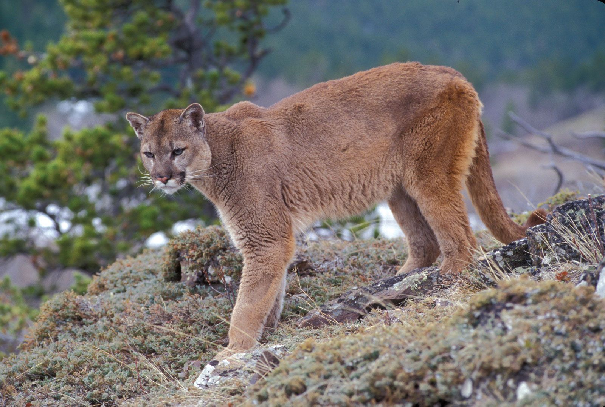
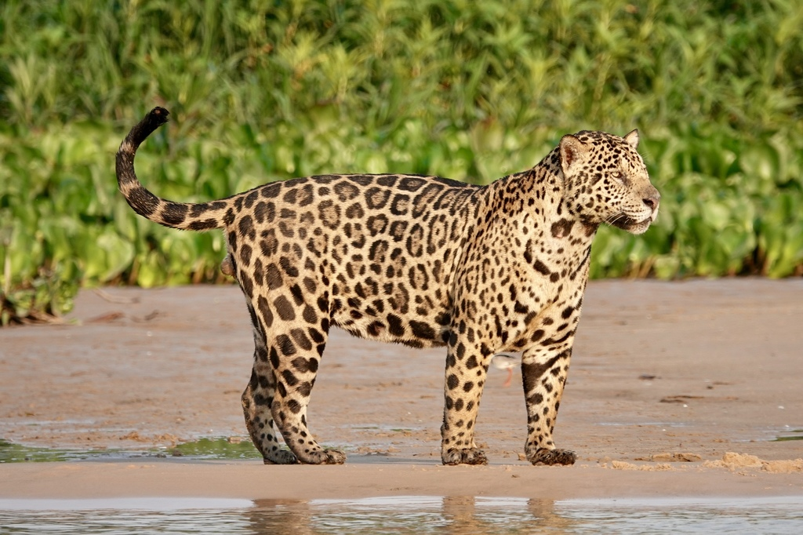
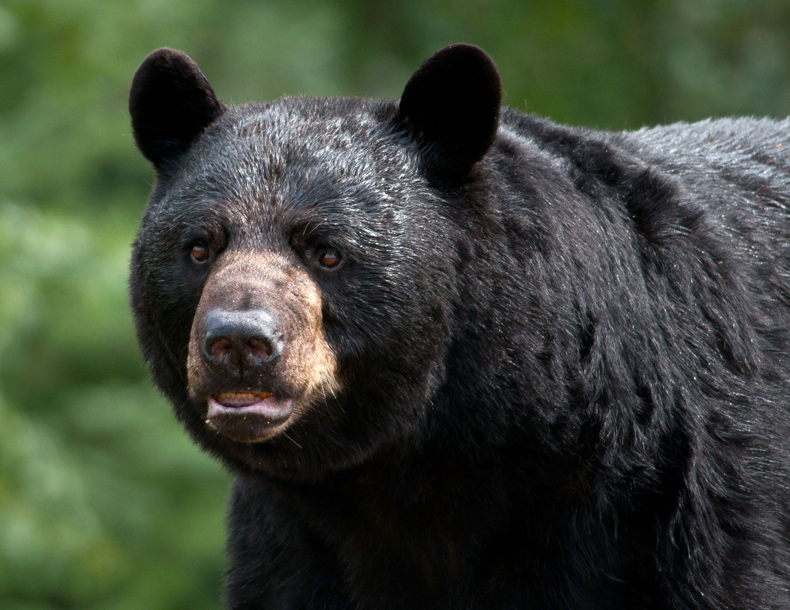

<!-- page number pos -->
\fancyhf{}
\fancyfoot[C]{\thepage}
\pagestyle{fancy}

<!-- no page nr on first page  -->
\pagenumbering{gobble}

<!-- Anger sidbrytning -->
\clearpage

<!-- creating the table of contents -->
\setcounter{tocdepth}{3}
\tableofcontents

<!-- new page -->
\clearpage

<!-- starting the count on 1 after the contents -->
\pagenumbering{arabic}
\setcounter{page}{1}

```{r setup, include=FALSE}
knitr::opts_chunk$set(echo = TRUE, message = FALSE, warning=FALSE, fig.width = 6, fig.height = 4)
```

# Question 1

Using the script http://ape-package.ird.fr/APER/APER2/SylviaWarblers.R obtain the Sylvia warblers phylogeny (the script saves in in the file sylvia nj k80.tre). The geographical range data can be found in http://ape-package.ird.fr/APER/APER2/sylvia_data.txt and in the script is referenced as DF$geo.range. Notice that one tip is removed due to missing data tr <- drop.tip(tr, "Chamaea_fasciata") and the data has to be ordered by the tips of the phylogeny DF <- sylvia.eco[tr$tip.label, ] WARNING: Running the script bare might result in errors and very long running times. Choose only the lines that you actually need!

## Question 1.1

Explain all the steps in the script required to obtain the phylogeny and trait data.

## Question 1.2∗

Analyze the discrete (type=discrete) geographical range variable (DF$geo.range) using ape::ace.
Consider different models (parameter model). Report on the results and interpret the estimated
rates and their standard errors.

# Question 2

Install the ade4 R package. Included with it you will find the carnivores dataset, data(carni70).

```{r}
library(ade4)
data(carni70)
```

## Question 2.1

Explore the data set and report what can be found in it. Provide some plots.


```{r}
data <- carni70$tab
data$animal <- rownames(data)

# first rows in the dataframe
knitr::kable(head(carni70$tab))
```

Seems to be about carnivores, each row is contains the latin names of the carnivores, their size in kg and range geographically in km.


```{r}
library(ggplot2)
library(dplyr)
 

# Identify outliers using IQR
Q1 <- quantile(data$size, 0.1)
Q3 <- quantile(data$size, 0.9)
IQR <- Q3 - Q1

outliers <- data %>%
  filter(size < (Q1 - 2 * IQR) | size > (Q3 + 2 * IQR))

outliers$index <- which(data$animal %in% outliers$animal) # get index

ggplot(data, aes(x = 1:nrow(data), y = size)) +
  geom_point(color = "blue", size=2) +
  geom_text(data = outliers, aes(x = index, y = size, label = gsub("_", " ", animal)), 
            vjust = 0, hjust = -0.1, color = "black", size=4.5) +
  labs(title = "Size of Carnivores (with the heaviest labeled)", x = "Index", y = "Size (kg)") +
  theme_minimal()+theme(
    plot.title = element_text(hjust = 0.5))
```


```{r}
# Identify outliers using IQR
Q11 <- quantile(data$range, 0.3)
Q33 <- quantile(data$range, 0.7)
IQR <- Q33 - Q11

outlier <- data %>%
  filter(range < (Q11 -  IQR) | range > (Q33 + IQR))

outlier$index <- which(data$animal %in% outlier$animal) # get index

ggplot(data, aes(x = 1:nrow(data), y = range)) +
  geom_point(color = "blue", size=2) +
  geom_text(data = outlier, aes(x = index, y = range, label = gsub("_", " ", animal)), 
            vjust = 0, hjust = -0.2, color = "black", size=4.5) +
  labs(title = "Range of Carnivores (with the longest span labeled)", x = "Index", y = "Range (km)") +
  theme_minimal()+theme(
    plot.title = element_text(hjust = 0.5))

# puma has clearly the longest geographical range of the carnivores. 
# There seems to be a group of carnivores that has a range between 14-28 and a
#group where the range is inbetween 0 and 7
```

Puma concolor has clearly the longest geographical range of the carnivores. There seems to be a group of carnivores that has a range between 14-28 and a group where the range is inbetween 0 and 7


```{r}
labels  <- rbind(outlier, outliers)


ggplot(data, aes(x = size, y = range)) +
  geom_point(aes(size = size), alpha = 1) + # Adjust size 
  geom_text(data = labels, aes(x = size, y = range, label = gsub("_", " ", animal)), 
            vjust = 1.5, hjust = 0.7, color = "black", size=4.5) +
  labs(title = "Range vs. Size of Carnivores ", 
       x = "Size(kg)", y = "Range (km)") +
  theme_minimal() +
  theme(legend.position = "bottom")+theme(
    plot.title = element_text(hjust = 0.5))


```


```{r}
# Categorize the range into three groups
data$range_group <- cut(data$range,
                        breaks = c(0, 10, 30, 50), # Define intervals
                        labels = c("0-10", "11-30", " >30"),
                        right = TRUE)
# Calculate the mean size for each range group
mean_size_by_group <- data %>%
  group_by(range_group) %>%
  summarize(mean_size = mean(size, na.rm = TRUE))

# Create the bar plot for the range categories with mean size labels
ggplot(data, aes(x = range_group)) +
  geom_bar(fill = "lightblue", color = "black") +
  geom_text(data = mean_size_by_group, aes(x = range_group, y = Inf, label = paste('Mean size:',round(mean_size, 2))), 
            vjust = 15, color = "black") + # Place text above the bars
  labs(title = "Distribution of Range Categories with Mean Size", 
       x = "Range Group", y = "Count") +
  theme_minimal()+theme(
    plot.title = element_text(hjust = 0.5))


# 

```

In general smaller carnivores in the group with a small range, but as we previous saw, there are a few carnivores with really high weight in this interval that makes the mean weight grow. Puma concolor is alone in its group.


## How to use your data to search the web for images.

```{r, eval=FALSE}


library(httr)
library(jsonlite)

# keys to use google api
api_key <- Sys.getenv("GOOGLE_API_KEY")
cse_id <- Sys.getenv("GOOGLE_CSE_ID")

# Function to search for an image using Google Custom Search API
fetch_image_url <- function(query, api_key, cse_id) {
  base_url <- "https://www.googleapis.com/customsearch/v1"
  
  # Make the API request
  res <- GET(base_url, query = list(
    q = query,
    searchType = "image",
    key = api_key,
    cx = cse_id,
    num = 1
  ))
  
  # Parse the response
  if (status_code(res) == 200) {
    img_url <- fromJSON(content(res, "text"))$items$link
    return(img_url)
  } else {
    warning("Failed to fetch image for: ", query)
    return(NA)
  }
}

setwd(dirname(rstudioapi::getActiveDocumentContext()$path)) # For RStudio users
# Fetch image URLs for each outlier
labels$image_url <- sapply(labels$animal, function(animal) {
  query <- gsub("_", " ", animal) # Format the query
  fetch_image_url(query, api_key, cse_id)
})

## key 
lapply(labels$image_url, knitr::include_graphics)

# Set the working directory to the folder containing the R script
setwd(dirname(rstudioapi::getActiveDocumentContext()$path)) # For RStudio users

# Download each image into the current working directory
labels$image_path <- sapply(seq_along(labels$image_url), function(i) {
  url <- labels$image_url[i]
  name <- labels$animal[i]
  
  if (!is.na(url)) {
    # Generate a safe filename
    safe_name <- gsub(" ", "_", gsub("[^a-zA-Z0-9 ]", "", name))
    file_path <- paste0(safe_name, ".jpg")
    
    # Download the file
    tryCatch({
      download.file(url, file_path, mode = "wb") # Binary mode for images
      return(file_path)
    }, error = function(e) {
      warning("Failed to download image for: ", name, " with error: ", e$message)
      return(NA)
    })
  } else {
    return(NA)
  }
})

```


```{r,echo=FALSE,fig.cap= 'Cougar (Puma concolor) is also known as Mountain Lion, Puma, or Panther in some regions. It is native to the Americas.'}

# 1. Cougar


```

\newpage

```{r,echo=FALSE,fig.cap='Jaguar (Panthera onca) is the largest cat in the Americas, known for its strength and distinctive coat pattern.'}
# 2. Jaguar


```


\newpage


```{r,echo=FALSE,fig.cap='Spectacled Bear (Tremarctos ornatus), also called Andean Bear, is native to South America and has unique facial markings.'}
# 3. Spectacled Bear
knitr::include_graphics("Tremarctosornatus.jpg")

```


\newpage


```{r,echo=FALSE,fig.cap='American Black Bear (Ursus americanus) is the most widely distributed bear species in North America.'}
# 4. American Black Bear


```


\newpage


```{r,echo=FALSE,fig.cap=' Brown Bear (Ursus arctos) includes subspecies like Grizzly Bear and Kodiak Bear, and is found in various regions across the world.'}
# 5. Brown Bear
knitr::include_graphics("Ursusarctos.jpg")

```


